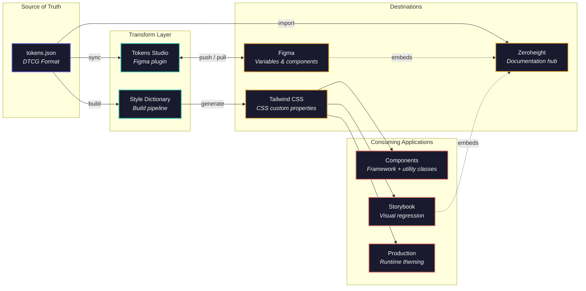

# Token Architecture — Full Landscape

How design tokens flow from a single source of truth through transform tools to design, development, and documentation destinations.

## Layer Detail

### Source of Truth — `tokens.json`

| Category | Contents |
|----------|----------|
| **Primitives** | Base color palettes — shared globals plus per-theme palettes |
| **Semantics** | Role-based aliases (`background`, `foreground`, `primary`) that map to primitives |
| **Typography** | Font family, font weight, composite type styles |
| **Animation** | Durations and easing curves |

### Transform Layer

| Tool | Role |
|------|------|
| **Style Dictionary** | Build pipeline — reads `tokens.json`, outputs CSS custom properties |
| **Tokens Studio** | Figma plugin — reads DTCG JSON from GitHub, pushes to Figma Variables, two-way sync via GitHub PR |

### Destinations

| Destination | Structure |
|-------------|-----------|
| **Figma** | Variable collections (Primitives, Semantic) with modes per theme. Components bind to semantic variables — swap mode to switch theme |
| **Tailwind CSS 4** | `:root` — primitives. `@theme` — semantic tokens. `[data-*]` — theme overrides. `.dark` — dark mode variants |
| **Zeroheight** | Imports DTCG JSON directly. Displays on Foundations pages (Color, Typography, Tokens). Embeds live Figma frames and Storybook stories |

### Consumers

| Consumer | How It Uses Tokens |
|----------|--------------------|
| **Components** | Utility classes (`bg-background`, `text-foreground`, `bg-primary`). Never hardcoded hex. Theme via data attribute |
| **Storybook / Chromatic** | Inherits CSS variables. Stories render in all themes. Visual regression snapshots per theme |
| **Production** | Runtime theme switching. Zero rebuild required |

## Current State vs. Full Pipeline

| Layer | Current (Case Study) | Full Pipeline (At Scale) |
|---|---|---|
| Source of truth | `tailwind.css` | `tokens.json` (DTCG) |
| Figma sync | Manual / MCP | Tokens Studio ↔ GitHub |
| CSS generation | Hand-authored | Style Dictionary output |
| Zeroheight | Manual documentation | DTCG JSON import |
| Storybook | Inherits CSS | Same |
| Components | Semantic tokens | Same |

## Key Tools

- **Style Dictionary** — Transform engine. One token format in, many outputs.
- **Tokens Studio** (formerly Figma Tokens) — Figma plugin that reads/writes DTCG JSON, syncs with GitHub, pushes to Figma Variables.
- **Cobalt UI** — Modern alternative to Style Dictionary, DTCG-native.
